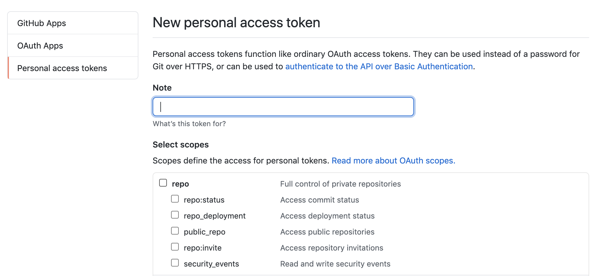

# 记录使用 Lerna 构建多包存储库的全流程

[](http://commitizen.github.io/cz-cli/)


## 初始化一个 lerna 仓库

1.这里使用**单独版本控制**
`lerna init --independent`

2.使用`yarn`客户端和`workspaces`

```json
// package.json
{
    "private": true, // 必须在private:true的情况下才能开启workspaces
    "workspaces": ["packages/*"]
}

// lerna.json

{
    "useWorkspaces":true,
    "npmClient": "yarn"
}
```

3.安装项目的`lerna`和`lerna-changelog`
`npm install -D lerna lerna-changelog`

4.配置`lerna-changelog`标签，后期会使用该标签给merged分支打标记，并生成`CHANGELOG.md`内容

```json
{
  "changelog": {
    "repo": "vuejs/vue-cli",
    "nextVersion": "Unreleased",
    "labels": {
      "PR: New Feature": ":rocket: New Features",
      "PR: Breaking Change": ":boom: Breaking Changes",
      "PR: Bug Fix": ":bug: Bug Fix",
      "PR: Documentation": ":memo: Documentation",
      "PR: Internal": ":house: Internal",
      "PR: Underlying Tools": ":hammer: Underlying Tools"
    },
    "cacheDir": ".changelog"
  }
}
```

5.使用`lerna-changelog`必须在从 github 获取[Personal access tokens](https://github.com/settings/tokens)，然后本地环境变量添加`GITHUB_AUTH`。如果是私有仓库选择 scope `repo`，如果是公开的仓库选择 scope `public_repo`。



## 创建一个`package`

1.创建一个`package`
`lerna create @qinzhiwei1993/element1 --access public --es-module --license MIT`

2.基于 vue+element 封装业务组件

> 添加`vue`和`element-ui`同级相关依赖和本地启动编译执行文件

```json
// packages/element1/package.json
"scripts": {
    "dev": "vue-cli-service serve",
    "build": "vue-cli-service build",
  },
"devDependencies": {
    "@vue/cli-service": "^4.5.6", // 启动本地服务
    "sass": "^1.26.10",
    "sass-loader": "^10.0.2",
    "terser-webpack-plugin": "^4.2.0",
    "vue-template-compiler": "^2.6.12" // vue模板编译
  },
  "peerDependencies": { // 同级vue 和 element-ui依赖
    "element-ui": "^2.13.2",
    "view-design": "^4.3.2",
    "vue": "^2.6.12"
  }
```

> 配置本地服务用来启动 example

```javascript
// packages/element1/vue.config.js
const path = require("path");
const TerserPlugin = require("terser-webpack-plugin");
module.exports = {
  lintOnSave: false,
  runtimeCompiler: true,
  css: { extract: false },
  devServer: {
    // 热更新 打开
    hot: true,
    host: "localhost",
    port: 3008,
  },
  // 扩展 webpack 配置
  chainWebpack: (config) => {
    config.entry("app").clear(); // 清除之前的默认entry

    config // 自定义入口文件
      .entry("app")
      .add(path.resolve(__dirname, "./examples/main.js"))
      .end();

    config.resolve.alias.set("@", path.resolve(__dirname, "./src"));
  },

  // 打包优化
  configureWebpack: {
    optimization: {
      minimizer: [
        new TerserPlugin({
          terserOptions: { compress: { drop_console: true } },
        }),
      ],
    },
  },
  productionSourceMap: true,
};
```

> 在项目根目录配置脚本，执行`element1/package.json`中的脚本

```javascript
// package.json
"scripts": {
    "dev:element1": "lerna exec --scope @qinzhiwei1993/element1 -- npm run dev"
}

```

> 添加基于element组件的业务组件 `/packages/element1/packages`

> 自动生成element1组件库的入口文件，入口文件位置在`/packages/element1/src/index.js`

`scripts/build/bin/build-entry.js`

> 获取当前package版本号，赋予本地

`scripts/build/bin/version.js`

> element1业务组件打包输出


## 基于[Commitizen](https://github.com/commitizen/cz-cli)和[conventional-changelog](https://github.com/ajoslin/conventional-changelog)`生成CHANGELOG.md`

1.安装本地commitizen
`npm install -D commitizen`

2.使项目支持 Angular 的 Commit message 格式，添加适配器
`commitizen init cz-conventional-changelog --save-dev --save-exact`

3.安装`husky`和[validate-commit-msg](https://github.com/conventional-changelog-archived-repos/validate-commit-msg)校验提交commit-msg

```json
{
  "husky": {
    "hooks": {
      "prepare-commit-msg": "exec < /dev/tty && git cz --hook || true", // 对git commit拦截，使项目维护人员统一使用commitizen
      "commit-msg": "validate-commit-msg"
    }
  }
}
```

> `validate-commit-msg`注意事项: 

1.遵循格式: <type>(<scope>): <subject>
2.本地添加.vcmrc文件配置校验文件


打包构建

lerna-changelog

http://www.ruanyifeng.com/blog/2016/01/commit_message_change_log.html
conventional-changelog

.version

